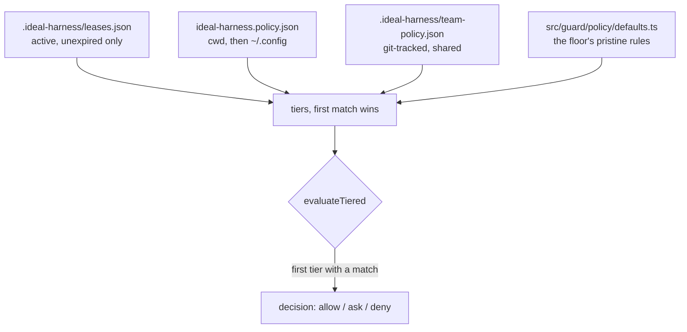
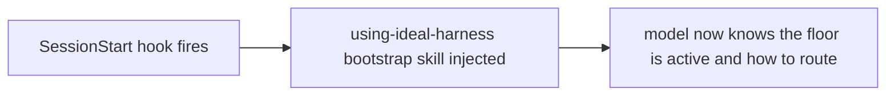
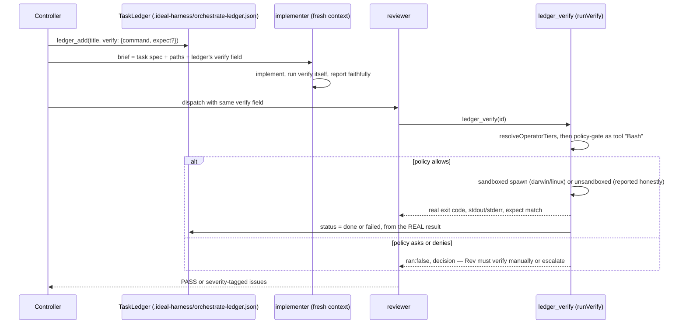
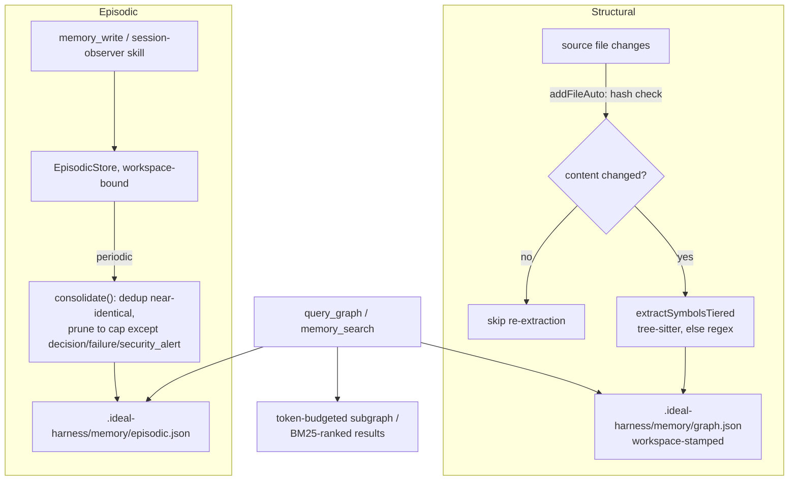
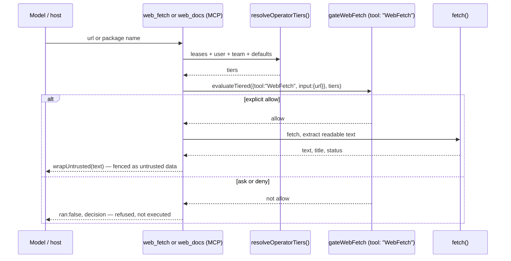
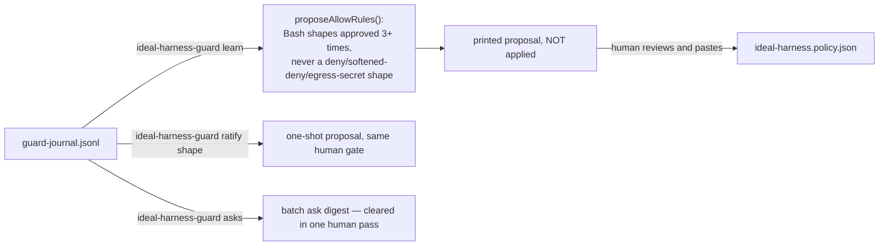
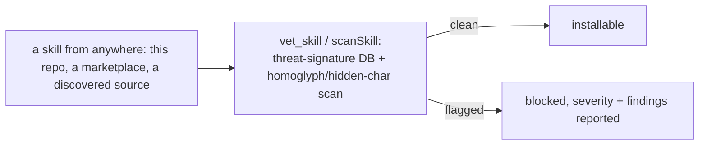

# Flow — how a call actually moves through the harness

> `DESIGN.md` is the static architecture (what layer owns what). `VISION.md` is the
> possibility space (what it could become). This file is neither — it's the **execution
> path**: what actually happens, in what order, when a tool call, a session, or a task
> moves through the harness. Written for whoever is integrating the harness into a
> product or pipeline and needs to know exactly what fires, when, and what it costs —
> not just what modules exist.
>
> Text-only (Mermaid, rendered natively on GitHub). No new tooling generates or reads
> this file — it is documentation, not a runtime artifact, so it costs nothing at
> runtime and cannot silently drift in a way that breaks anything; it can only go stale,
> which a PR reviewer catches the same way they'd catch a stale comment. See
> `decisions.md` for *why* each of these flows looks the way it does.

---

## 1. A tool call, Tier 1 (Claude Code, automatic)

The floor's core loop. Runs on **every** tool call, unconditionally, before the call
executes and again before the model sees the result. See `decisions.md` D003–D005, D019.

```mermaid
sequenceDiagram
    participant M as Model
    participant Pre as PreToolUse hook
    participant R as resolveOperatorTiers()
    participant P as evaluateTiered()
    participant J as guard-journal.jsonl
    participant T as the actual tool
    participant Post as PostToolUse hook

    M->>Pre: propose tool call (tool, input)
    Pre->>R: leases + user policy + team policy + defaults
    R-->>Pre: tiers, most specific first
    Pre->>P: evaluateTiered({tool, input}, tiers)
    P-->>Pre: action (allow/ask/deny), ruleId, reason
    Pre->>Pre: egress-secret scan (Bash/Write/Edit/WebFetch)
    Pre->>Pre: applyFloorMode (soft: deny to ask; bypass: to allow)
    Pre->>Pre: injection-cue escalation (allow to ask)
    Pre->>J: append decision, redacted, hash-chained
    Pre-->>M: permissionDecision
    alt allowed
        M->>T: tool actually runs
        T-->>Post: raw result
        Post->>Post: redactSecrets, mask before the model reads it
        Post->>Post: wrapUntrusted if external or injection-flagged
        Post-->>M: rewritten result
    else asked or denied
        Note over M: no execution; human decides (ask) or refused (deny)
    end
```

**Cost:** two synchronous child-process hook invocations per tool call (Node cold-start
each time — no long-running daemon). This is the one real per-call overhead the floor
adds; everything else in this document is opt-in or off the hot path.

---

## 2. Operator policy tier resolution (`resolveOperatorTiers`)

The exact same composition backs the interactive hook above **and** every non-interactive
MCP tool that performs its own gated I/O (`ledger_verify`, `web_fetch`, `web_docs`) — one
function, not three drifting copies. See `decisions.md` D019.



A broken or missing file at any tier is fine (falls through); a broken *default* rule
list is not possible (it's checked-in code, not user input). Nothing here ever widens
permissions on a load failure — see `decisions.md` D014.

---

## 3. Session start (Tier 1)



One-shot, at the top of a session. No per-turn cost.

---

## 4. Orchestrate — a ledger task from creation to verified done



Independent tasks can fan out into isolated git worktrees
(`worktree_create`/`worktree_list`/`worktree_remove`, under
`.ideal-harness/worktrees/<id>`) so concurrent implementers never collide on one working
tree — each worktree is a real `git worktree add`, cleaned up on `worktree_remove`.

**Spend and loop guards** (`spend_check`, `loop_check`) sit beside this loop, not inside
it — the controller calls them explicitly before/around dispatching work. They are
deterministic gates (a hard token cap; a same-action-N-times-in-a-row stall detector),
but like any MCP tool, they only bind if the controller actually calls them; nothing
forces a call the way the PreToolUse hook forces policy evaluation. This is the honest
boundary of what "the model calls a tool" (12-Factor #4) can guarantee versus what an
automatic hook guarantees — see `README.md`'s Tier 1 / Tier 2 split.

---

## 5. Memory — write, read, and the persistence boundary



**Isolation by construction:** the MCP server binds to one workspace at startup; every
record is workspace-stamped on write and re-filtered on load, so a misplaced or merged
snapshot cannot leak another project's data into this one. Persistence is always
project-local (`<root>/.ideal-harness/memory/`), never `$HOME`. A corrupt snapshot file
is quarantined (renamed `.corrupt`) rather than looping the same parse failure — the
server starts fresh instead of refusing to start.

**What crosses a project boundary, and how:** nothing, automatically — that's the
default forever (`decisions.md` D017). The Obsidian bridge (`memory vault-export` /
`vault-import`, CLI-only) is the one sanctioned, human-invoked crossing, and it's
export/import of a human-owned Markdown vault, never a live sync.

---

## 6. Web — a gated fetch (Tier 1 and Tier 2 identical)



Same rule name (`WebFetch`) the native tool uses, so an operator's existing WebFetch
policy — allow, ask, or deny — governs both uniformly; a differently-named MCP tool is
never a quiet side door around it (`decisions.md` D018).

---

## 7. The learning loop — proposals only, human ratifies



The floor never writes to its own policy file — `ideal-harness.policy.json` is covered
by the same self-policy deny pattern that protects `settings.json` and
`src/guard/policy/`. A proposal is text on stdout until a human commits it.

---

## 8. Skill vetting — before a skill ever loads



Runs once, at install/load time — not on every invocation of an already-vetted skill.

---

## Tier map — what's automatic vs. what a caller must invoke

| Flow | Tier 1 (Claude Code) | Tier 2 (any MCP host / library embed) |
|---|---|---|
| §1 Policy + redaction + injection fencing | Automatic, every call | Caller must invoke `policy_check`/`redact` itself, or embed `resolveOperatorTiers`+`evaluateTiered` directly |
| §2 Tier resolution | Inside §1, automatic | Same function (`resolveOperatorTiers`), called explicitly |
| §3 Bootstrap skill | Automatic at SessionStart | N/A — inject the skill text yourself if your host supports it |
| §4 Ledger + verify + worktrees | MCP tools, always explicit calls (no host auto-invokes orchestration) | Identical — same MCP tools/CLI |
| §5 Memory read/write/persist | MCP tools, explicit calls | Identical |
| §6 Web fetch | MCP tools, explicit calls, self-gated internally | Identical |
| §7 Learning loop | CLI only, human-run | Identical |
| §8 Skill vetting | MCP tool / CLI, explicit | Identical |

Nothing in the right column is missing capability — it's the honest Tier-2 boundary
`README.md` already states: hook-driven *automaticity* doesn't travel off Claude Code;
the primitives underneath it (every function in this document) do.
